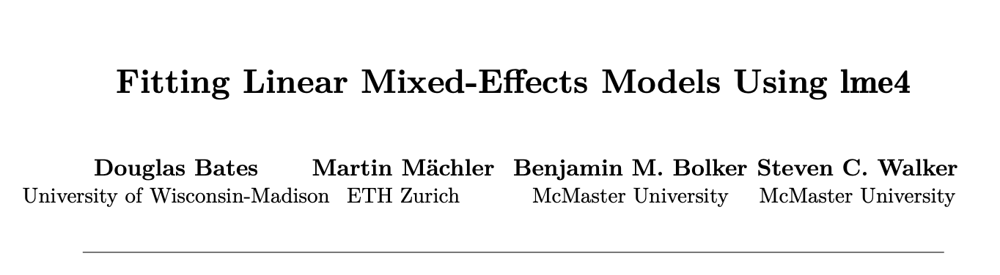
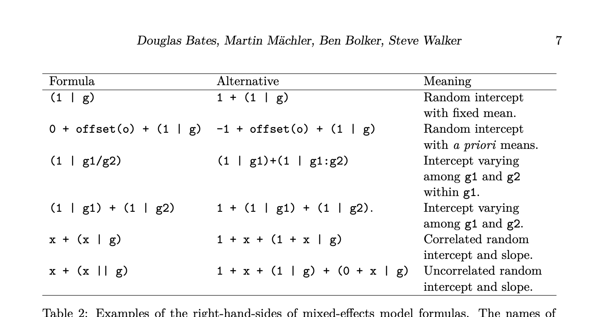

```{r setup, include=FALSE}
knitr::opts_chunk$set(
  echo = TRUE, 
  fig.width = 6, 
  fig.asp = 0.618, 
  out.width = "70%",
  fig.align = "center", 
  root.dir = '../'
)
pacman::p_load(
  tidyverse, lubridate, stringr, glue, lme4, lmerTest
)
source("../code/get_label.R")
source("../code/visualise_ci.R")
source("../code/get_cov.R")
```

# Read in clean data

```{r}
TSH_long  <- read_rds("../data/20190712-02_convert_long.rds")
```


# Modelling

## Three thyroid tests

We will use a mixed-effect model with the paper ID as a random intercept and thyroid method as a fixed effect. 

Need to convert `Sig` to factor. Also remove missing

```{r}
TSH_long  <- 
  TSH_long %>% 
  mutate(Sig = factor(Sig))
```

```{r}
TSH_long <- 
  TSH_long %>% filter(!is.na(Sig))
```


Load necessary packages

```{r}
pacman::p_load(lme4, lmerTest)
```

### Random effects

Start with single fixed effect - thyroid test, and single random intercept (RI) for each paper. 

```{r}
tsh_glmer  <- glmer(Sig ~ Thyroid_test + (1 | Paper), data = TSH_long, family = binomial)
```

Compare model to one without RI.

```{r}
tsh_glm  <- glm(Sig ~ Thyroid_test, data = TSH_long, family = binomial)
anova(tsh_glmer, tsh_glm)
```

Looks like need RI. 

### Fixed effects

Test for significant differences between tests. 

```{r}
tsh_glmer_null  <- glmer(Sig ~ 1 + (1 | Paper), data = TSH_long, family = binomial)
anova(tsh_glmer, tsh_glmer_null)
```

Looks like significant effect of test. 

Also check with BIC - smaller is better. 

```{r}
BIC(tsh_glmer_null, tsh_glm, tsh_glmer)
```

So far best model is fixed effect of test with RI. 

```{r}
summary(tsh_glmer)
```

From this - look at fixed effect output. We have that TSH has a signicantly smaller probability of significance compared to T4. T3 and T4 are not significantly different. 


## Four thyroid tests

Will remove single T3

```{r}
TSH_long %>% count(Thyroid_test_4)
```

# HERE

```{r}
tsh_glmer  <- glmer(Sig ~ Thyroid_test_4 + (1 | Paper), data = TSH_long, family = binomial)
tsh_glm  <- glm(Sig ~ Thyroid_test_4, data = TSH_long, family = binomial)
anova(tsh_glmer, tsh_glm)
tsh_glmer_null  <- glmer(Sig ~ 1 + (1 | Paper), data = TSH_long, family = binomial)
anova(tsh_glmer, tsh_glmer_null)
summary(tsh_glmer)
```


```{r}
pacman::p_load(multcomp)
summary(glht(tsh_glmer, linfct = mcp(Thyroid_test_4 = "Tukey")))
```

## Try adding in other covariates. 

### System

```{r, cache=TRUE}
system_models  <- get_cov("system")
system_models %>% arrange(BIC) %>% knitr::kable()
```

### N of subjects

```{r, cache=TRUE}
N_models  <- get_cov("N_bin")
N_models %>% arrange(BIC) %>% knitr::kable()
```

### Number of covariates

```{r, cache=TRUE}
n_cov_models  <- get_cov("n_cov")
n_cov_models %>% arrange(BIC) %>% knitr::kable()
```


So we seem to have a lot of problems getting the RI to fit. May be able to tinker and improve. Looking at the various possible covariates we find that some of them increase the prediction of the probability of significance - system and number of subject. This is based on BIC. Number of covariates does not seem to improve the model. 

# Model to take into account cohorts

Looked at the lme4 paper

```{r, echo = FALSE}

```

The notation is given in Table 2 of the paper:

```{r, echo = FALSE}

```


Looks like we want

```
(1 | paper/cohort)
```

```{r}
tsh_glmer_M_paperRI  <- glmer(Sig ~ Thyroid_test + (1 | Paper), 
                              data = TSH_long, family = binomial)
tsh_glmer_M_paper_cohort_RI  <- glmer(Sig ~ Thyroid_test + (1 | Paper / cohort), 
                                      data = TSH_long, family = binomial)
tsh_glmer_M_no_test  <- glmer(Sig ~ 1 + (1 | Paper / cohort), 
                              data = TSH_long, family = binomial)
```


First test for whether need cohort RI:

```{r}
anova(tsh_glmer_M_paperRI, tsh_glmer_M_paper_cohort_RI)
```

Small p-value so looks like we need cohort and paper RI. 

No test for significant effect of test

```{r}
anova(tsh_glmer_M_paper_cohort_RI, tsh_glmer_M_no_test)
```

So still significant effect of type of test. 

Look at effect of test. 

```{r}
summary(tsh_glmer_M_paper_cohort_RI)
```

As before probability of significance is significantly lower than FT4 and T3. 

```{r}
plot(tsh_glmer_M_paper_cohort_RI)
```

# Model to take into account style

Will be similar to above. First examine possible styles

```{r}
TSH_long %>% 
  count(CvQ) %>% 
  knitr::kable()
```

Need to talk to NB about which to keep. 

# Model to take into account sophistication

```{r}
TSH_long %>% 
  count(Sophistication)
```

Need to remove NAs

```{r}
TSH_long_noNA  <- 
  TSH_long %>% 
  filter(!is.na(Sophistication))
```


Fit all models

```{r}
tsh_glmer_M_paperRI  <- glmer(Sig ~ Thyroid_test + (1 | Paper), 
                              data = TSH_long_noNA, family = binomial)
tsh_glmer_M_paper_soph_RI  <- glmer(Sig ~ Thyroid_test + (1 | Paper / Sophistication), 
                                      data = TSH_long_noNA, family = binomial)
tsh_glmer_M_no_test  <- glmer(Sig ~ 1 + (1 | Paper / cohort), 
                              data = TSH_long_noNA, family = binomial)
```

First test for whether need sophistication RI:

```{r}
anova(tsh_glmer_M_paperRI, tsh_glmer_M_paper_soph_RI)
```

Not significant so not needed. 


# Look at selected systems

```{r}
TSH_long <- 
  TSH_long %>% 
  mutate(high_low = case_when(
    str_detect(Condition, "AF") ~ "high", 
    str_detect(Condition, "low bone density") ~ "high", 
    system == "cancer" ~ "high", 
    str_detect(Condition, "fatty liver") ~ "low", 
    system == "metabolic" ~ "low", 
    TRUE ~ "neither"
  ))
```


```{r}
visualise_ci(TSH_long, high_low)
```

```{r}
high_low_models  <- get_cov("high_low")
```

```{r}
high_low_models %>% arrange(BIC) %>% knitr::kable()
```

